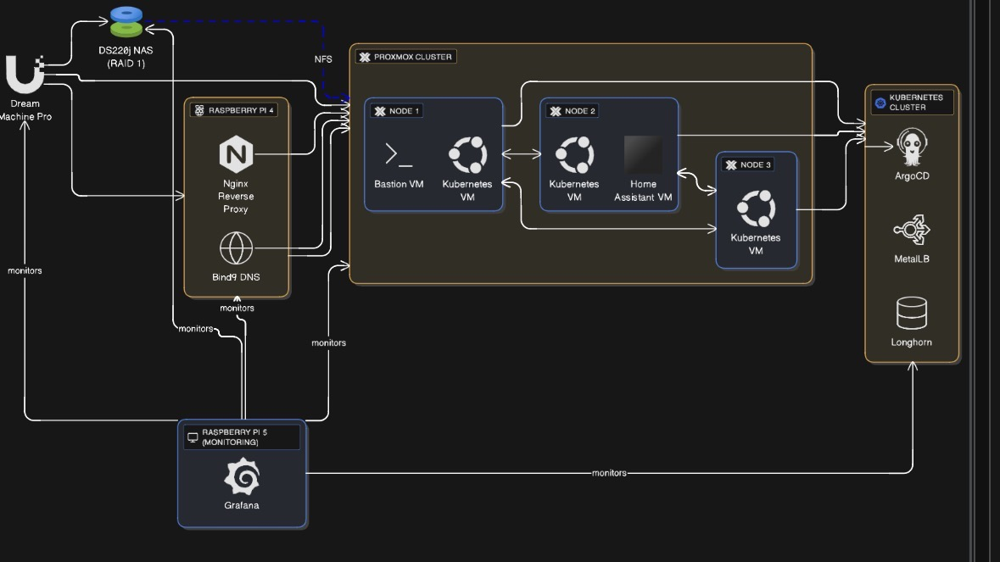

# Homelab

This repository documents my home lab a self-hosted environment with Kubernetes, networking, storage, and Raspberry Pi services using reproducible configs and manifests.

## Repository Structure

- **Kubernetes:** Core cluster setup and apps — see [kubernetes/](kubernetes/) and [kubernetes/README.md](kubernetes/README.md)
- **Network:** Diagrams and docs — see [network/](network/) and [network/README.md](network/README.md)
- **Services:** Self-hosted apps and stacks — see [services/](services/) and [services/rpi4/README.md](services/rpi4/README.md)
- **Monitoring:** Placeholders and docs for observability — see [monitoring/](monitoring/) and [monitoring/README.md](monitoring/README.md)
- **Images:** Architecture and setup visuals — see [images/](images/)

## Key Components

### Kubernetes Cluster
The [kubernetes/](kubernetes/) directory contains everything needed to provision, bootstrap, and manage a home Kubernetes cluster:

- **VM Provisioning:** Terraform configs in [kubernetes/terraform/](kubernetes/terraform/) define base VMs for the cluster.
- **Cluster Bootstrap:** Ansible playbooks in [kubernetes/ansible/](kubernetes/ansible/) prepare nodes and install Kubernetes.
- **Networking:** Canal CNI (Flannel + Calico) for pod networking.
- **GitOps:** Argo CD for declarative app deployment and management.
- **Load Balancing:** MetalLB for bare-metal LoadBalancer services.
- **Storage:** Longhorn for distributed block storage.
- **ArgoCDInstall Script:** [kubernetes/install-argocd.sh](kubernetes/install-argocd.sh) automates Argo CD deployment.

See [kubernetes/README.md](kubernetes/README.md) for detailed setup instructions.

### Services (Raspberry Pi 4)
Self-hosted services running on Raspberry Pi hardware:

- **DNS (Bind9):** Authoritative DNS with zone files in [services/rpi4/bind9/](services/rpi4/bind9/)
- **Reverse Proxy (Nginx):** TLS termination and routing in [services/rpi4/nginxrp/](services/rpi4/nginxrp/)

Each service uses Docker Compose for easy deployment and management. See [services/rpi4/README.md](services/rpi4/README.md) for usage.

### Network & Monitoring
- **Network:** Documentation and topology diagrams — see [network/README.md](network/README.md)
- **Monitoring:** Observability stack placeholders and future dashboards — see [monitoring/README.md](monitoring/README.md)

## Getting Started

For setup instructions, see the README files in each subdirectory:
- Kubernetes cluster setup: [kubernetes/README.md](kubernetes/README.md)
- Raspberry Pi services: [services/rpi4/README.md](services/rpi4/README.md)

Configuration files that contain sensitive data (passwords, IPs, hostnames) are either gitignored or provided as `.example` templates.

## License
This project is licensed under the terms in [LICENSE](LICENSE).

