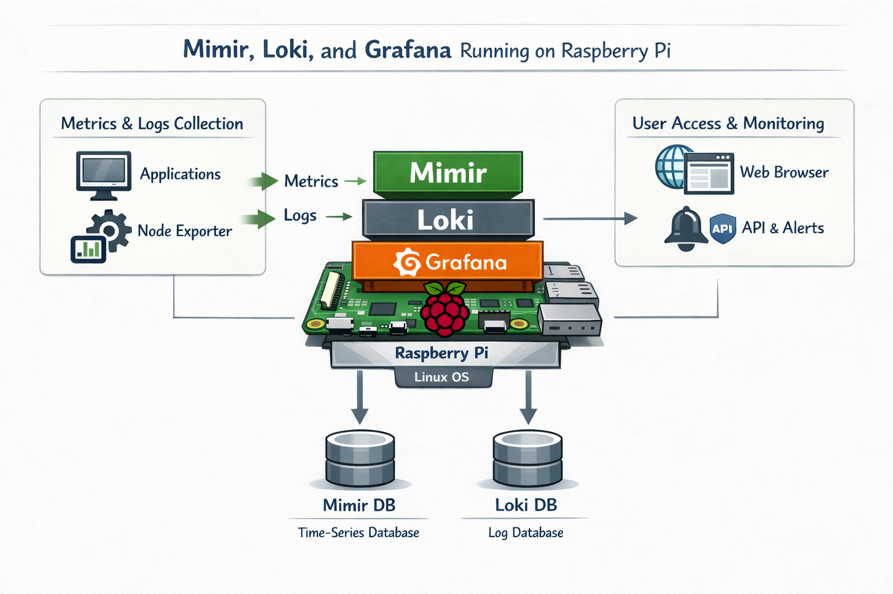

# Mimir, Loki, and Grafana on Raspberry Pi

This project shows how to run a complete metrics and logs monitoring stack on a single Raspberry Pi using **Mimir**, **Loki**, and **Grafana**.

The stack collects metrics and logs from your applications and host system, stores them in dedicated databases, and exposes them through Grafana dashboards, APIs, and alerts.

---

## Architecture Overview

The setup consists of three main parts:

1. **Metrics & Logs Collection**
   - **Applications** expose metrics and emit logs.
   - **Node Exporter** collects Raspberry Pi system metrics (CPU, memory, disk, network, etc.).
   - Metrics and logs are sent to the Raspberry Pi where the monitoring stack runs.

2. **Monitoring Stack on Raspberry Pi**
   - **Raspberry Pi** runs a Linux OS and hosts all monitoring components.
   - **Mimir** receives and stores time-series metrics.
   - **Loki** receives and stores log data.
   - **Grafana** provides dashboards, visualization, and alerting on top of Mimir and Loki.

3. **User Access & Monitoring**
   - Users access **Grafana** via a **web browser**.
   - **APIs & alerts** provide programmatic access and notifications based on metrics and log queries.

---

## Components

### Mimir (Metrics Storage)

- Stores time-series metrics from applications and Node Exporter.
- Optimized for high cardinality and long-term metric storage.
- Queried by Grafana for dashboards, panels, and alert rules.

### Loki (Log Storage)

- Stores logs from applications and system services.
- Designed for efficient indexing by labels rather than full-text.
- Queried by Grafana using LogQL for log search and correlation with metrics.

### Grafana (Dashboards & Alerts)

- Connects to:
  - **Mimir** as a Prometheus-compatible metrics data source.
  - **Loki** as a logs data source.
- Provides:
  - Custom dashboards for system and application monitoring.
  - Alerting rules based on metrics and log queries.
  - API access for automation and integration.

---

## Data Flow

1. **Applications** and **Node Exporter** generate:
   - **Metrics** (Prometheus-style time-series).
   - **Logs** (application and system logs).

2. On the **Raspberry Pi**:
   - Metrics are ingested into **Mimir** and persisted in the **Mimir DB** (time-series database).
   - Logs are ingested into **Loki** and persisted in the **Loki DB** (log database).

3. **Grafana** reads data from:
   - **Mimir DB** for metrics dashboards and alerts.
   - **Loki DB** for log exploration and correlation with metrics.

4. Users access **Grafana** via a **web browser** and optionally use:
   - **APIs** to query metrics and logs or manage resources.
   - **Alerts** to get notified when conditions or thresholds are met.

---

## Typical Use Cases

- Home lab or small environment monitoring running entirely on a Raspberry Pi.
- Unified view of:
  - Raspberry Pi system health (via Node Exporter metrics).
  - Application performance and error rates.
  - Logs for debugging and root cause analysis.
- Experimenting with the Mimir + Loki + Grafana stack in a low-cost, low-power setup.
