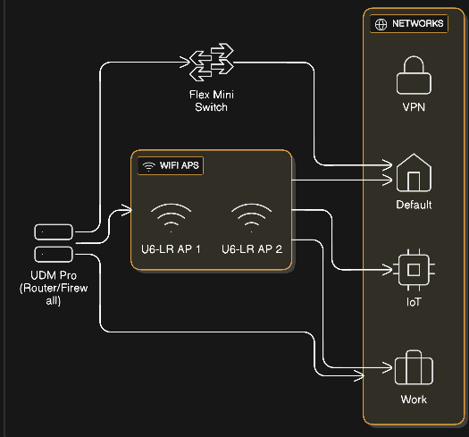

# Home Network Topology

This document describes the home network topology as represented in the attached diagram.

## Overview

The network is built around a UniFi Dream Machine Pro (UDM Pro) acting as the primary router and firewall. A Flex Mini switch provides additional wired connectivity, and two U6-LR access points provide wireless coverage. Multiple logical networks (VLAN-backed) segment traffic by use case.

## Core Components

### UDM Pro (Router/Firewall)

- Serves as the main router, firewall, and gateway for all networks.
- Manages VLANs and routing between:
  - VPN
  - Default
  - IoT
  - Work
- Provides DHCP and firewall rules per network.
- Uplinks to:
  - Flex Mini switch (for wired distribution).
  - Both U6-LR access points (for PoE and data, or via intermediate switch depending on physical layout).

### Flex Mini Switch

- Layer 2 UniFi switch providing additional Ethernet ports.
- Trunked to the UDM Pro carrying multiple VLANs.
- Used to:
  - Extend wired connectivity to APs or other wired devices.
  - Pass tagged VLAN traffic for segmented networks (Default, IoT, Work, etc.).

### WiFi Access Points (U6-LR AP 1 & U6-LR AP 2)

- Two UniFi U6-LR access points provide WiFi coverage.
- Each AP broadcasts multiple SSIDs mapped to the VLAN-backed networks:
  - Default (home/general SSID)
  - IoT (isolated SSID for smart devices)
  - Work (separate SSID for work gear)
- APs connect (directly or indirectly) to the UDM Pro over Ethernet, carrying tagged VLAN traffic for each SSID.

## Logical Networks

### VPN Network

- Network dedicated for VPN clients.
- Provides secure remote access into the home environment.
- Routed and firewalled by the UDM Pro.
- Typically not broadcast as a WiFi SSID; access is via VPN tunnels (WireGuard).

### Default Network

- Primary LAN for general household devices (laptops, phones, tablets, TVs).
- Accessible via:
  - Wired ports (UDM Pro / Flex Mini).
  - Default WiFi SSID on both U6-LR APs.
- Can reach internet and, as desired, selected internal services.

### IoT Network

- Segmented VLAN for Internet of Things / smart home devices.
- Accessible via:
  - IoT SSID on U6-LR APs.
  
### Work Network

- Dedicated VLAN for work-related devices (laptops, workstations, lab gear).
- Accessible via:
  - Work SSID on U6-LR APs.
  - Optional wired ports configured for this VLAN.