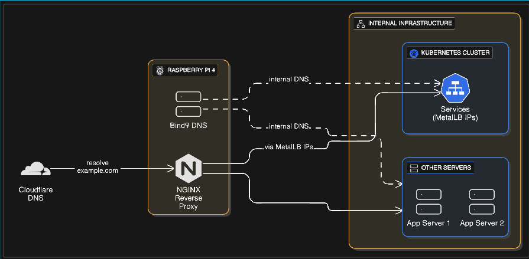

# Services

- Bind9 for internal DNS
- NGINX as a reverse proxy
- Cloudflare for public DNS

The goal is to provide a simple, self‑hosted way to expose internal services securely while keeping a clear separation between public and private DNS.

---

## Architecture Diagram

---

## High‑Level Flow

- Cloudflare DNS resolves `example.com` to the public IP of your home network.
- The Raspberry Pi receives inbound HTTP(S) traffic and terminates TLS via NGINX.
- NGINX routes incoming requests to:
  - Services in the Kubernetes cluster using MetalLB‑assigned IPs.
  - Other internal servers (e.g., App Server 1/2) using their internal IPs.
- Bind9 provides internal DNS resolution so that:
  - Internal clients can resolve service hostnames to MetalLB IPs.
  - Other internal servers can resolve each other via consistent host
